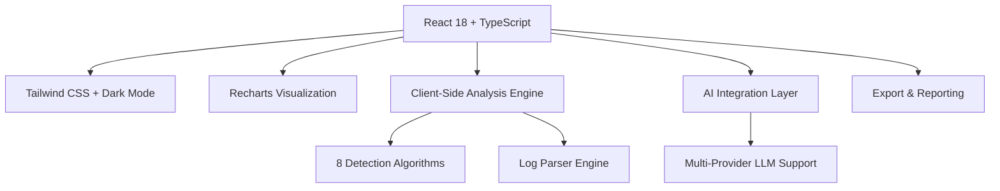

# 🛡️ Cyber Detect

> **Advanced Client-Side Security Log Analysis Platform**
> Detect, analyze, and respond to cyber threats with AI-powered insights - all running securely in your browser.

[](https://sanand0.github.io/cyberdetect/)
[](https://github.com/sanand0/cyberdetect)
[](LICENSE)

---

## 🌟 Overview

**Cyber Detect** is a cutting-edge, browser-based security log analysis platform that empowers security professionals and developers to identify, analyze, and respond to cyber threats without compromising data privacy. Built with modern web technologies, it processes log files entirely client-side, ensuring your sensitive security data never leaves your machine.

### ✨ Key Highlights

- 🔒 **100% Client-Side Processing** - Your data stays on your machine
- 🤖 **AI-Powered Analysis** - Multi-provider AI integration for intelligent insights
- 🎯 **8 Advanced Detection Engines** - Comprehensive threat detection capabilities
- 📊 **Interactive Dashboards** - Real-time visualizations and analytics
- 🌙 **Modern UI/UX** - Dark/light themes with responsive design
- 📈 **Export & Reporting** - Professional reports in multiple formats

---

## 🚀 Live Demo

Experience the platform instantly: **[https://sanand0.github.io/cyberdetect/](https://sanand0.github.io/cyberdetect/)**

Try it with our demo dataset or upload your own Apache/Nginx log files!

---

## 🎯 Core Features

### 🔍 Advanced Threat Detection

| Attack Type            | Severity  | Description                                                                                          |
| ---------------------- | --------- | ---------------------------------------------------------------------------------------------------- |
| **SQL Injection**      | 🔴 High   | Advanced detection of union-based, boolean-based, time-based, and error-based SQL injection attempts |
| **Path Traversal**     | 🔴 High   | Directory traversal attempts and suspicious path patterns                                            |
| **LFI/RFI Attacks**    | 🔴 High   | Local and Remote File Inclusion attack detection                                                     |
| **Brute Force**        | 🔴 High   | Password brute force and credential stuffing detection                                               |
| **Bot Detection**      | 🟡 Medium | Identification of crawlers, scrapers, and automated tools                                            |
| **WordPress Probes**   | 🟡 Medium | WordPress-specific vulnerability scanning attempts                                                   |
| **Internal IP Access** | 🟡 Medium | Detection of internal network access attempts                                                        |
| **HTTP Errors**        | 🟢 Low    | Analysis of suspicious HTTP error patterns                                                           |

### 🤖 AI-Powered Intelligence

- **Multi-Provider Support**: Google Gemini, OpenAI GPT, Anthropic Claude, AIPipe, and custom endpoints
- **Dynamic Analysis Creation**: Describe threats in natural language, AI creates detection logic
- **Comprehensive Reports**: AI-generated security assessment reports with actionable recommendations
- **Custom Threat Detection**: Create personalized detection rules using AI assistance

### 📊 Analytics & Visualization

- **Interactive Dashboards**: Real-time charts and graphs using Recharts
- **Threat Timeline**: Visualize attack patterns over time
- **Geographic Analysis**: IP-based attack origin mapping
- **Status Code Distribution**: HTTP response analysis
- **Top Attackers**: Identify persistent threat actors

### 🔧 Advanced Capabilities

- **Faceted Search & Filtering**: Multi-dimensional data exploration
- **Export Options**: CSV, JSON, HTML, and Markdown formats
- **Log Format Support**: Apache/Nginx combined log format with auto-decompression
- **File Processing**: Support for .log, .txt, .zip, and .gz files
- **Responsive Design**: Optimized for desktop, tablet, and mobile devices

---

## 🏗️ Architecture

### Technology Stack



### Core Components

- **Frontend**: React 18 with TypeScript for type safety
- **Styling**: Tailwind CSS with custom design system
- **Charts**: Recharts for interactive data visualization
- **Icons**: Lucide React for consistent iconography
- **Build Tool**: Vite for fast development and optimized builds
- **Analysis Engine**: Custom JavaScript/TypeScript detection algorithms
- **AI Integration**: Multi-provider LLM service abstraction

### Security Architecture

```
┌─────────────────┐    ┌──────────────────┐    ┌─────────────────┐
│   Browser       │    │  Analysis Engine │    │  AI Providers   │
│                 │    │                  │    │                 │
│ ┌─────────────┐ │    │ ┌──────────────┐ │    │ ┌─────────────┐ │
│ │ File Upload │ │───▶│ │ Log Parser   │ │    │ │ Gemini      │ │
│ └─────────────┘ │    │ └──────────────┘ │    │ └─────────────┘ │
│                 │    │ ┌──────────────┐ │    │ ┌─────────────┐ │
│ ┌─────────────┐ │    │ │ 8 Detectors  │ │    │ │ OpenAI      │ │
│ │ Dashboard   │ │◀───│ └──────────────┘ │    │ └─────────────┘ │
│ └─────────────┘ │    │ ┌──────────────┐ │    │ ┌─────────────┐ │
│                 │    │ │ AI Analysis  │ │───▶│ │ Anthropic   │ │
│ ┌─────────────┐ │    │ └──────────────┘ │    │ └─────────────┘ │
│ │ Export      │ │    │                  │    │ ┌─────────────┐ │
│ └─────────────┘ │    │                  │    │ │ Custom APIs │ │
└─────────────────┘    └──────────────────┘    │ └─────────────┘ │
                                               └─────────────────┘
```

---

## 🚀 Quick Start

### Prerequisites

- **Node.js** 18+ and npm
- Modern web browser with JavaScript enabled

### Installation

```bash
# Clone the repository
git clone https://github.com/sanand0/cyberdetect.git
cd cyberdetect

# Install dependencies
npm install

# Start development server
npm run dev
```

### Usage

1. **📁 Upload Log File**: Drag and drop your log file or try the demo dataset
2. **🔍 Run Analysis**: Click "Run All Scans" or analyze specific threat types
3. **📊 View Results**:
   - **Overview**: Attack type cards with threat counts
   - **Dashboard**: Interactive charts and visualizations
   - **Data Table**: Detailed, filterable results
4. **🤖 AI Analysis**: Configure AI provider and get intelligent insights
5. **📄 Generate Reports**: Create comprehensive security reports
6. **💾 Export Data**: Download results in CSV, JSON, or HTML formats

### Supported Log Format

```
IP - - [timestamp] "METHOD /path HTTP/1.1" status bytes "referrer" "user-agent" host server_ip
```

**Example:**

```
192.168.1.100 - - [01/Jan/2024:12:00:00 +0000] "GET /admin/login.php HTTP/1.1" 200 1234 "-" "Mozilla/5.0..." example.com 10.0.0.1
```

---

## 🔧 Configuration

### AI Provider Setup

The platform supports multiple AI providers for enhanced analysis:

#### Google Gemini (Recommended)

```javascript
// Get your free API key from Google AI Studio
const GEMINI_API_KEY = "your-gemini-api-key";
```

🔗 [Get Gemini API Key](https://makersuite.google.com/app/apikey)

#### OpenAI GPT

```javascript
const OPENAI_API_KEY = "your-openai-api-key";
```

🔗 [Get OpenAI API Key](https://platform.openai.com/api-keys)

#### Custom Endpoints

```javascript
const CUSTOM_ENDPOINT = "https://your-api-endpoint.com/v1/chat/completions";
const API_KEY = "your-api-key";
```

### Environment Variables

```bash
# Optional: Set base path for deployment
VITE_BASE_PATH=/your-deployment-path/
```

---

## 📊 Detection Algorithms

### SQL Injection Detection

- **Union-based injections**: `UNION SELECT` patterns
- **Boolean-based blind**: Logic manipulation attempts
- **Time-based blind**: `SLEEP()`, `WAITFOR` functions
- **Error-based**: Database error exploitation
- **Authentication bypass**: Login circumvention attempts

### Path Traversal Detection

- **Directory traversal**: `../` and encoded variants
- **Excessive depth**: Unusual directory nesting
- **System file access**: `/etc/passwd`, `/proc/` attempts

### Bot Detection

- **Known crawlers**: Google, Bing, social media bots
- **Client libraries**: curl, wget, Python requests
- **Suspicious user agents**: Empty or malformed headers

### Advanced Pattern Matching

- **Regex-based detection**: Sophisticated pattern recognition
- **Whitelist filtering**: Reduce false positives
- **Context-aware analysis**: Consider request context
- **Severity scoring**: Risk-based threat classification

---

## 📈 Performance

### Optimization Features

- **Client-Side Processing**: No server round trips for analysis
- **Lazy Loading**: Components loaded on demand
- **Virtual Scrolling**: Handle large datasets efficiently
- **Memoization**: Optimized React rendering
- **Code Splitting**: Reduced initial bundle size

### Benchmarks

| Metric             | Performance             |
| ------------------ | ----------------------- |
| **Initial Load**   | < 2 seconds             |
| **Log Processing** | ~1000 entries/second    |
| **Memory Usage**   | < 100MB for 10K entries |
| **Bundle Size**    | < 2MB gzipped           |

---

## 🔒 Security & Privacy

### Privacy-First Architecture

- **No Data Transmission**: All processing happens locally
- **No Storage**: Log data processed in memory only
- **API Key Security**: Keys stored locally, never transmitted to our servers
- **HTTPS Only**: Secure communication with AI providers
- **No Tracking**: No analytics or user tracking

### Security Measures

- **Input Validation**: Comprehensive file and data validation
- **XSS Protection**: Sanitized output rendering
- **CSP Headers**: Content Security Policy implementation
- **Dependency Scanning**: Regular security audits
- **Safe Execution**: Sandboxed AI-generated code execution

---

## 🚀 Deployment

### GitHub Pages (Current)

The application is automatically deployed to GitHub Pages:

```bash
# Build and deploy
npm run build
npm run deploy
```

🔗 **Live URL**: [https://sanand0.github.io/cyberdetect/](https://sanand0.github.io/cyberdetect/)

### Alternative Deployment Options

#### Netlify

```bash
# Build command
npm run build

# Publish directory
dist
```

#### Vercel

```bash
# Install Vercel CLI
npm i -g vercel

# Deploy
vercel --prod
```

#### Docker

```dockerfile
FROM node:18-alpine
WORKDIR /app
COPY package*.json ./
RUN npm ci --only=production
COPY . .
RUN npm run build
EXPOSE 3000
CMD ["npm", "run", "preview"]
```

---

## 🛠️ Development

### Project Structure

```
cyberdetect/
├── 📁 src/
│   ├── 📁 components/          # React components
│   │   ├── AttackTypeCard.tsx  # Individual attack type display
│   │   ├── Dashboard.tsx       # Analytics dashboard
│   │   ├── DataTable.tsx       # Results table with filtering
│   │   ├── FileUpload.tsx      # Drag & drop file upload
│   │   ├── ReportModal.tsx     # AI report generation
│   │   └── ...
│   ├── 📁 services/            # Business logic services
│   │   ├── clientSideAnalysis.ts  # Core analysis engine
│   │   ├── llmProviders.ts        # AI provider abstraction
│   │   ├── reportGeneration.ts    # Report generation service
│   │   └── ...
│   ├── 📁 utils/               # Utility functions
│   │   ├── 📁 detectors/       # Threat detection algorithms
│   │   │   ├── sqlInjection.ts # SQL injection detection
│   │   │   ├── pathTraversal.ts # Path traversal detection
│   │   │   └── ...
│   │   ├── logParser.ts        # Log file parsing
│   │   └── dataProcessing.ts   # Data transformation
│   ├── 📁 hooks/               # Custom React hooks
│   ├── 📁 types/               # TypeScript definitions
│   └── 📁 config/              # Configuration files
├── 📁 public/                  # Static assets
├── 📄 package.json             # Dependencies and scripts
├── 📄 tailwind.config.js       # Tailwind CSS configuration
├── 📄 vite.config.ts           # Vite build configuration
└── 📄 README.md                # This file
```

### Available Scripts

```bash
# Development
npm run dev          # Start development server
npm run build        # Build for production
npm run preview      # Preview production build
npm run lint         # Run ESLint

# Deployment
npm run predeploy    # Pre-deployment build
npm run deploy       # Deploy to GitHub Pages
```

### Code Quality

- **TypeScript**: Full type safety throughout the application
- **ESLint**: Code linting with React and TypeScript rules
- **Prettier**: Consistent code formatting
- **Husky**: Git hooks for quality assurance
- **Conventional Commits**: Standardized commit messages

---

## 📄 License

This project is licensed under the **MIT License** - see the [LICENSE](LICENSE) file for details.

```
MIT License

Copyright (c) 2024 Aayansh Yadav

Permission is hereby granted, free of charge, to any person obtaining a copy
of this software and associated documentation files (the "Software"), to deal
in the Software without restriction, including without limitation the rights
to use, copy, modify, merge, publish, distribute, sublicense, and/or sell
copies of the Software, and to permit persons to whom the Software is
furnished to do so, subject to the following conditions:

The above copyright notice and this permission notice shall be included in all
copies or substantial portions of the Software.
```

---

## 📊 Project Stats


---

<div align="center">

### 🛡️ Secure Your Digital Assets Today

**[Try Live Demo](https://sanand0.github.io/cyberdetect/)** • **[View Source](https://github.com/sanand0/cyberdetect)** • **[Report Issues](https://github.com/sanand0/cyberdetect/issues)**

---

**Made with ❤️ by [Aayansh Yadav](https://github.com/sanand0)**

_Empowering cybersecurity professionals with intelligent, privacy-first threat detection._

</div>
